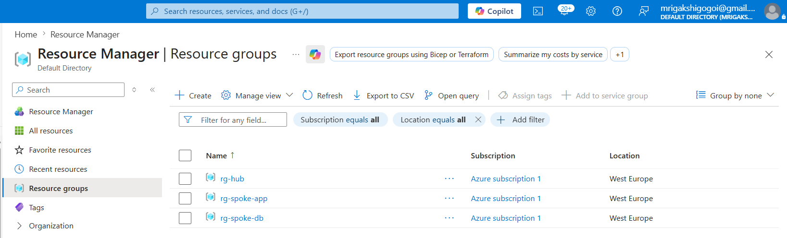
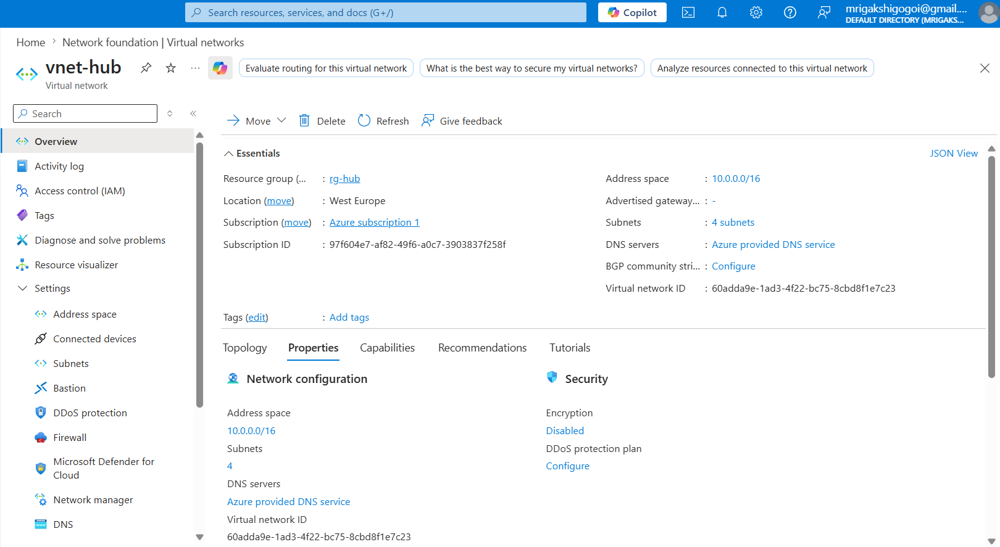
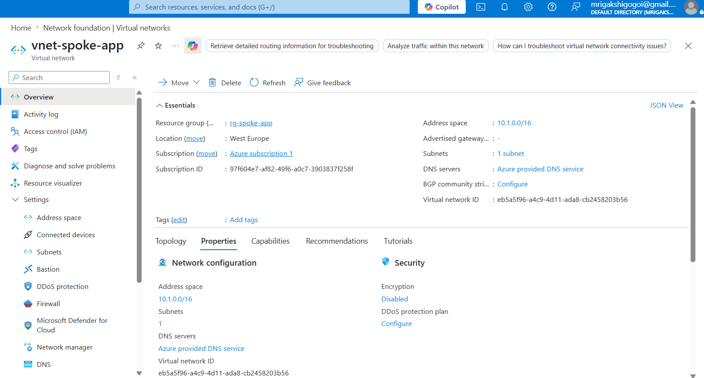
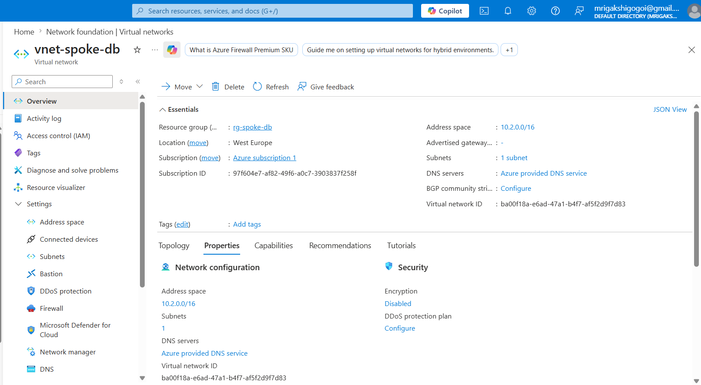
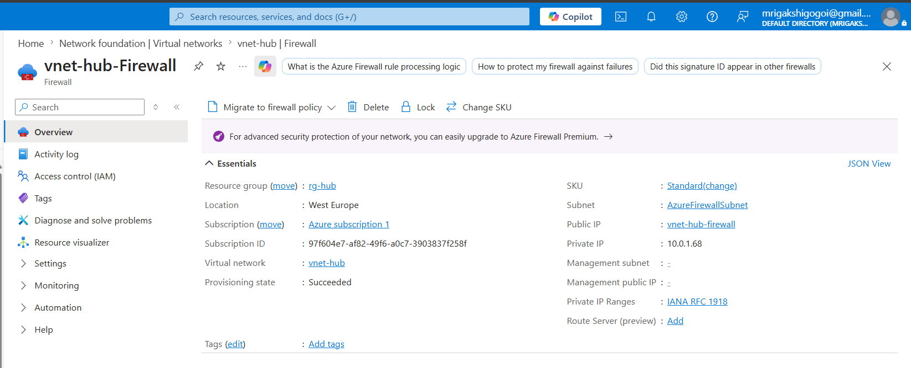
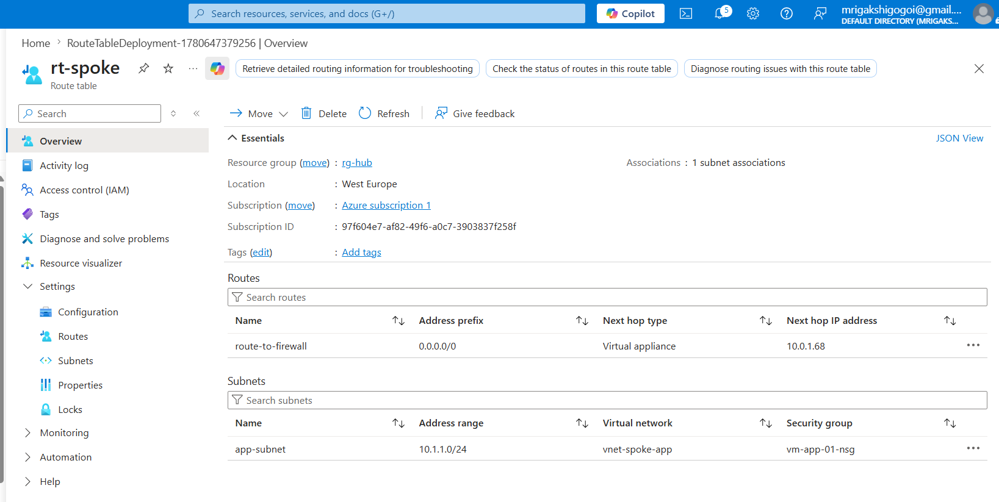
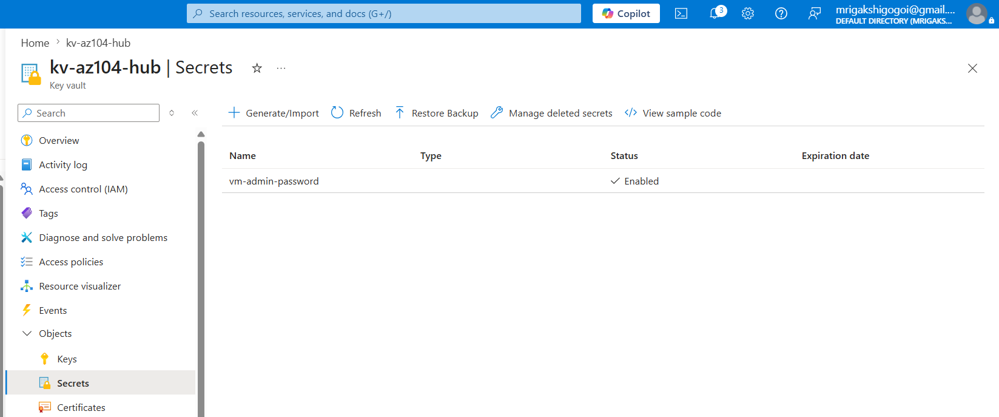
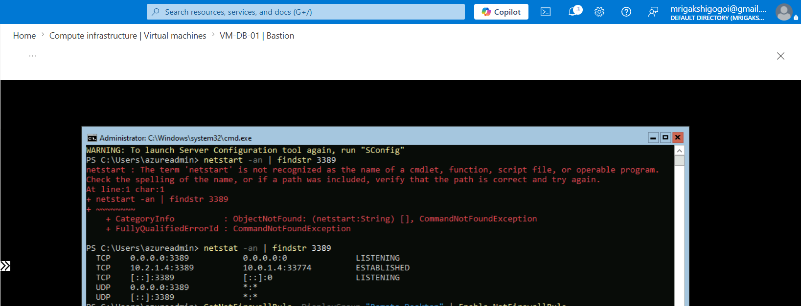

# Azure Hub-and-Spoke Enterprise Network Architecture (AZ-104)

## Overview

This project demonstrates the implementation of a secure and scalable Azure Hub-and-Spoke network architecture, a common enterprise networking model used to centralize security, connectivity, and shared services across multiple workloads.

The lab was designed and implemented using Microsoft Azure services and aligns with key networking, security, monitoring, and governance concepts covered in the Azure Administrator Associate (AZ-104) certification.

---

## Architecture Diagram

### Architecture Components

| Component               | Purpose                              |
| ----------------------- | ------------------------------------ |
| Hub VNet                | Centralized network services         |
| App Spoke VNet          | Application workload network         |
| DB Spoke VNet           | Database workload network            |
| Azure Bastion           | Secure VM access without public IPs  |
| Azure Firewall          | Centralized network security         |
| Network Security Groups | Traffic filtering and access control |
| Azure Monitor           | Monitoring and diagnostics           |
| Azure Key Vault         | Secure secret management             |

---

### Network Architecture

                         Internet
                             |
                      Azure Firewall
                             |
                      Hub VNet
                    (10.0.0.0/16)
                             |
        ---------------------------------------
        |                                     |
        |                                     |
   App Spoke VNet                      DB Spoke VNet
   (10.1.0.0/16)                      (10.2.0.0/16)
        |                                     |
   App Subnet                           DB Subnet
        |                                     |
    VM-App-01                           VM-DB-01

                             |
                      Azure Bastion
                   Secure RDP Access 

                   

## Skills Demonstrated

* Azure Virtual Networks (VNets)
* VNet Peering
* Hub-and-Spoke Network Design
* Network Security Groups (NSGs)
* Azure Bastion
* Azure Firewall
* User Defined Routes (UDRs)
* Azure Monitor
* Azure Key Vault
* Infrastructure Security
* Cloud Governance
* Azure Administration (AZ-104)

---

# Step 1 - Create Resource Groups

Created separate resource groups to logically organize Azure resources.

### Resource Groups

* rg-hub
* rg-spoke-app
* rg-spoke-db

### Screenshot

### Notes

Using separate resource groups improves governance, resource management, and cost control.

---

# Step 2 - Create Hub Virtual Network

Created the central Hub Virtual Network.

### Configuration

VNet Name:

vnet-hub

Address Space:

10.0.0.0/16

Subnets:

* AzureFirewallSubnet (10.0.1.0/24)
* AzureBastionSubnet (10.0.2.0/24)

### Screenshot

### Notes

The Hub VNet hosts shared services such as Azure Firewall and Azure Bastion that are consumed by spoke networks.

---

# Step 3 - Create Application Spoke Network

### Configuration

VNet Name:

vnet-spoke-app

Address Space:

10.1.0.0/16

Subnet:

app-subnet (10.1.1.0/24)

### Screenshot

---

# Step 4 - Create Database Spoke Network

### Configuration

VNet Name:

vnet-spoke-db

Address Space:

10.2.0.0/16

Subnet:

db-subnet (10.2.1.0/24)

### Screenshot

---

# Step 5 - Deploy Virtual Machines

Created two virtual machines to simulate enterprise workloads.

### Virtual Machines

| VM Name   | Purpose            |
| --------- | ------------------ |
| vm-app-01 | Application Server |
| vm-db-01  | Database Server    |

### Screenshot

### Notes

The virtual machines are deployed without public IP addresses to improve security.

---

# Step 6 - Configure VNet Peering

Established connectivity between the Hub and Spoke networks.

### Peerings Created

* Hub → App
* App → Hub
* Hub → DB
* DB → Hub

### Screenshot

### Notes

VNet Peering allows private communication between Azure virtual networks using Microsoft's backbone network.

---

# Step 7 - Deploy Azure Bastion

Implemented Azure Bastion to securely access virtual machines.

### Screenshot

### Notes

Azure Bastion eliminates the need for public IP addresses and provides browser-based RDP and SSH access.

---

# Step 8 - Configure Network Security Groups

Created and assigned Network Security Groups to control inbound and outbound traffic.

### Rules Configured

#### App NSG

* Allow RDP from Azure Bastion

#### Database NSG

* Allow RDP from Azure Bastion
* Allow ICMP from Application Subnet

### Screenshot

---

# Step 9 - Deploy Azure Firewall

Implemented Azure Firewall within the Hub network.

### Screenshot

### Notes

Azure Firewall provides centralized network traffic inspection and security enforcement.

---

# Step 10 - Configure Route Tables

Created User Defined Routes (UDRs) to direct traffic through Azure Firewall.

### Screenshot

### Notes

Traffic routing through Azure Firewall enables centralized inspection and control of network traffic.

---

# Step 11 - Configure Azure Key Vault

Created Azure Key Vault to securely store administrative credentials and secrets.

### Screenshot

### Notes

Azure Key Vault helps protect sensitive information and supports secure application development.

---

# Step 12 - Configure Monitoring

Enabled monitoring and diagnostics using Azure Monitor.

### Metrics Monitored

* CPU Utilization
* Memory Usage
* Network Traffic
* Virtual Machine Health

### Screenshot

---

# Step 13 - Test Connectivity

Validated communication between application and database workloads.

### Test Performed

From:

vm-app-01

To:

vm-db-01

Using:

* Ping
* Test-NetConnection

### Screenshot

### Result

Successful communication confirmed between both virtual machines.

---

# Key Learnings

* Enterprise Hub-and-Spoke Architecture Design
* Secure Network Segmentation
* Azure Firewall Deployment
* Azure Bastion Administration
* Virtual Network Peering
* Route Table Configuration
* Network Security Group Management
* Secret Management with Azure Key Vault
* Monitoring and Diagnostics using Azure Monitor

---

# Conclusion

Successfully designed and implemented a secure Hub-and-Spoke network architecture in Microsoft Azure.

The project demonstrates practical Azure Administrator (AZ-104) skills in networking, security, monitoring, governance, and infrastructure management. Through the implementation of VNet Peering, Azure Firewall, Azure Bastion, NSGs, Route Tables, Key Vault, and Azure Monitor, this lab simulates a real-world enterprise Azure environment and showcases hands-on cloud administration capabilities.
